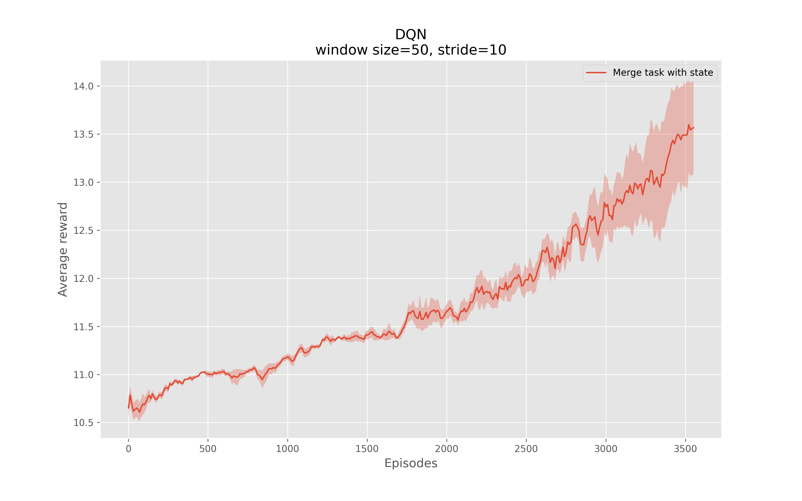

# Deep Reinforcement Learning Based Decision-Making in Autonomous Driving Tasks


## Table of Contents

- [Introduction](#introduction)
- [Environment](#environment)
- [Action Space](#action-space)
- [State Space](#state-space)
- [Reward Function](#reward-function)
- [Deep Q-Learning Network (DQN) Algorithm](#deep-q-learning-network-dqn-algorithm)
- [Usage](#usage)
- [Results](#results)
  - [Merge-v0 Task](#merge-v0-task)
  - [Highway-Fast Task](#highway-fast-task)
  - [CNN Network and Observation](#cnn-network-and-observation)

## Introduction

This project explores the application of Deep Reinforcement Learning in the context of autonomous driving. The agents are trained using the `DQN` algorithm on different driving environments (`merge-v0` and `highway-fast-v0`). The project includes training with state representations and CNN-based observations, along with transfer learning techniques to enhance agent performance.

## Environment

We utilize the [HighwayEnv](https://github.com/Farama-Foundation/HighwayEnv) environment for this project. HighwayEnv is a highly configurable simulator for highway driving scenarios, providing realistic settings for testing various autonomous driving tasks. It supports multiple driving scenarios and offers a flexible API for integration with reinforcement learning frameworks.

The environments used for training and evaluating the agents are:

- **merge-v0**: Simulates a highway merging scenario.
- **highway-fast-v0**: Simulates high-speed highway driving.

## Action Space

The action space defines the set of possible actions that the agent (autonomous vehicle) can take. In HighwayEnv, the action space consists of 5 discrete meta-actions:

- **0: Lane-Left**: Move the vehicle one lane to the left.
- **1: IDLE**: Maintain the current lane and speed.
- **2: Lane-Right**: Move the vehicle one lane to the right.
- **3: Faster**: Increase the vehicle's speed.
- **4: Slower**: Decrease the vehicle's speed.

The `DiscreteMetaAction` type adds a layer of speed and steering controllers on top of the continuous low-level control, so that the ego-vehicle can automatically follow the road at a desired velocity. Then, the available meta-actions consist in changing the target lane and speed that are used as setpoints for the low-level controllers.

## State Space

The state space represents the current situation of the environment, which the agent uses to make decisions. In HighwayEnv, each state is a $V \times F$ array that describes a list of $V$ nearby vehicles by a set of features of size $F$. For instance:

| Presence | Vehicle      | x     | y     | vx    | vy    |
|----------|--------------|-------|-------|-------|-------|
| 1        | ego-vehicle  | 0.05  | 0.04  | 0.75  | 0     |
| 1        | vehicle 1    | -0.1  | 0.04  | 0.6   | 0     |
| 1        | vehicle 2    | 0.13  | 0.08  | 0.675 | 0     |
| ...      | ...          | ...   | ...   | ...   | ...   |
| 1        | vehicle V    | 0.222 | 0.105 | 0.9   | 0.025 |

- **Rows**: Each row represents a vehicle, with the first row always representing the ego vehicle.
- **Columns**: Each column is a feature that is described below:

  | Feature | Description |
  | :--- | :--- |
  | presence | Disambiguate agents at 0 offset from non-existent agents. |
  | Vehicle | Indicates the vehicle's name. |
  | $x$ | World offset of ego vehicle or offset to ego vehicle on the $x$ axis. |
  | $y$ | World offset of ego vehicle or offset to ego vehicle on the y axis. |
  | $v x$ | Velocity on the $x$ axis of vehicle. |
  | $v y$ | Velocity on the y axis of vehicle. |

## Reward Function

In HighwayEnv, the reward function balances speed optimization and collision avoidance:

$$
R(s, a) = a \frac{v - v_{\min}}{v_{\max} - v_{\min}} - b \cdot \text{collision}
$$

### Components of the Reward Function

- **Speed Reward**: Encourages the agent to drive at higher speeds, scaled between the minimum $v_{\min}$ and maximum $v_{\max}$ speeds.
- **Collision Penalty**: Penalizes the agent for collisions with other vehicles, promoting safer driving behavior.
- **Coefficients $a$ and $b$**: Adjust the influence of speed optimization and collision avoidance in the overall reward.

---

## Deep Q-Learning Network (DQN) Algorithm

Deep Q-learning is a value-based reinforcement learning algorithm where a neural network is used to approximate the Q-value function, which predicts the expected cumulative reward for taking an action in a given state. The `Decision-Making Using Deep Reinforcement Learning in Autonomous Driving Tasks.ipynb` includes implementations of Q-learning with both linear and convolutional neural networks (CNNs), experience replay, and various training and evaluation procedures.

### Hyperparameters

The following hyperparameters are used in our DQN implementation:

| Parameter                           | Value  |
|-------------------------------------|--------|
| BUFFER_SIZE                         | 10000  |
| BATCH_SIZE                          | 64     |
| GAMMA                               | 0.99   |
| UPDATE_EVERY                        | 4      |
| Learning rate (LR)                  | 0.0005 |
| α (Q-learning parameter)            | 0.001  |
| Epsilon start                       | 1      |
| Epsilon end                         | 0.001  |
| Epsilon decay                       | 0.995  |
| Number of iterations (runs)         | 5      |
| Number of episodes                  | 3600   |
| Max step                            | 10000  |

### Class Structure

- `QNetwork_Linear`: Defines the linear neural network architecture.
- `QNetwork_CNN`: Defines the convolutional neural network architecture.
- `ReplayBuffer`: Implements the experience replay buffer.
- `Agent`: Encapsulates the DQN agent's behavior.
- `DQN`: Handles training and evaluation of the agent.
  - `train_with_state`: Trains the agent using state-based observations.
  - `train_with_observation`: Trains the agent using image-based observations.
  - `evaluation`: Evaluates the trained agent.

#### Linear Network

The linear neural network consists of three fully connected layers:

```python
class QNetwork_Linear(nn.Module):
    def __init__(self, state_size, action_size, seed):
        super(QNetwork_Linear, self).__init__()
        self.seed = torch.manual_seed(seed)
        self.fc1 = nn.Linear(state_size, 125)
        self.fc2 = nn.Linear(125, 125)
        self.fc3 = nn.Linear(125, action_size)

    def forward(self, state):
        x = self.fc1(state)
        x = F.relu(x)
        x = self.fc2(x)
        x = F.relu(x)
        x = self.fc3(x)
        return x
```

#### CNN Network

The CNN architecture includes convolutional, max-pooling, and dropout layers followed by fully connected layers:

```python
class QNetwork_CNN(nn.Module):
    def __init__(self, action_size, seed):
        super(QNetwork_CNN, self).__init__()
        self.seed = torch.manual_seed(seed)
        self.conv1 = nn.Conv2d(3, 128, kernel_size=3)
        self.relu = nn.ReLU()
        self.maxpool = nn.MaxPool2d(kernel_size=2)
        self.dropout = nn.Dropout(0.1)
        self.conv2 = nn.Conv2d(128, 128, kernel_size=3)
        self.flatten = nn.Flatten()
        self.fc1 = nn.Linear(38912, 64)
        self.fc2 = nn.Linear(64, action_size)

    def forward(self, state):
        x = self.dropout(self.maxpool(self.relu(self.conv1(state))))
        x = self.dropout(self.maxpool(self.relu(self.conv2(x))))
        x = self.flatten(x)
        x = self.fc1(x)
        x = self.relu(x)
        x = self.fc2(x)
        return x
```

#### Replay Buffer

The `ReplayBuffer` class stores experiences and samples them for training:

```python
class ReplayBuffer():
    def __init__(self, action_size, buffer_size, batch_size, seed):
        self.action_size = action_size
        self.memory = deque(maxlen=buffer_size)
        self.batch_size = batch_size
        self.experience = namedtuple("Experience", field_names=["state", "action", "reward", "next_state", "done"])
        self.seed = random.seed(seed)

    def add(self, state, action, reward, next_state, done):
        e = self.experience(state, action, reward, next_state, done)
        self.memory.append(e)

    def sample(self):
        experiences = random.sample(self.memory, k=self.batch_size)
        states = torch.from_numpy(np.vstack([e.state for e in experiences if e is not None])).float().to(device)
        actions = torch.from_numpy(np.vstack([e.action for e in experiences if e is not None])).long().to(device)
        rewards = torch.from_numpy(np.vstack([e.reward for e in experiences if e is not None])).float().to(device)
        next_states = torch.from_numpy(np.vstack([e.next_state for e in experiences if e is not None])).float().to(device)
        dones = torch.from_numpy(np.vstack([e.done for e in experiences if e is not None]).astype(np.uint8)).float().to(device)
        return (states, actions, rewards, next_states, dones)

    def __len__(self):
        return len(self.memory)
```

#### Agent Class

The `Agent` class implements the DQN algorithm, managing the Q-networks, the optimizer, and the interaction with the replay buffer:

```python
class Agent():
    def __init__(self, state_size, action_size, network_type, seed):
        self.state_size = state_size
        self.action_size = action_size
        self.seed = random.seed(seed)
        self.network_type = network_type

        if network_type in ['linear', 'Linear']:
            self.qnetwork_local = QNetwork_Linear(state_size, action_size, seed).to(device)
            self.qnetwork_target = QNetwork_Linear(state_size, action_size, seed).to(device)
        elif network_type in ['cnn', 'CNN']:
            self.qnetwork_local = QNetwork_CNN(action_size, seed).to(device)
            self.qnetwork_target = QNetwork_CNN(action_size, seed).to(device)

        self.optimizer = optim.Adam(self.qnetwork_local.parameters(), lr=LR)
        self.memory = ReplayBuffer(action_size, BUFFER_SIZE, BATCH_SIZE, seed)
        self.t_step = 0
        self.resize = T.Compose([T.ToPILImage(), T.Resize(40, interpolation=Image.CUBIC), T.ToTensor()])

    def get_screen(self, screen):
        screen = np.ascontiguousarray(screen, dtype=np.float32) / 255
        screen = torch.from_numpy(screen)
        screen = screen.permute(2, 0, 1)
        screen_resized = self.resize(screen).unsqueeze(0)
        return screen_resized

    def step(self, state, action, reward, next_state, done):
        self.memory.add(state, action, reward, next_state, done)
        self.t_step = (self.t_step + 1) % UPDATE_EVERY
        if self.t_step == 0:
            if len(self.memory) > BATCH_SIZE:
                experiences = self.memory.sample()
                self.learn(experiences, GAMMA)

    def act(self, state, eps=0):
        if self.network_type in ['linear', 'Linear']:
            state = torch.from_numpy(state).float().unsqueeze(0).to(device)
        elif self.network_type in ['cnn', 'CNN']:
            state = state.to(device)
        self.qnetwork_local.eval()
        with torch.no_grad():
            action_values = self.qnetwork_local(state)
        self.qnetwork_local.train()
        if random.random() > eps:
            return np.argmax(action_values.cpu().data.numpy())
        else:
            return random.choice(np.arange(self.action_size))

    def learn(self, experiences, gamma):
        states, actions, rewards, next_states, dones = experiences
        q_targets_next = self.qnetwork_target(next_states).detach().max(1)[0].unsqueeze(1)
        q_targets = rewards + gamma * q_targets_next * (1 - dones)
        q_expected = self.qnetwork_local(states).gather(1, actions)
        loss = F.mse_loss(q_expected, q_targets)
        self.optimizer.zero_grad()
        loss.backward()
        self.optimizer.step()
        self.soft_update(self.qnetwork_local, self.qnetwork_target, 𝛼)

    def soft_update(self, local_model, target_model, 𝛼):
        for target_param, local_param in zip(target_model.parameters(), local_model.parameters()):
            target_param.data.copy_(𝛼*local_param.data + (1-𝛼)*target_param.data)
```

#### DQN Class

The `DQN` class manages the training and evaluation of the agent, providing methods for both **state-based** and **observation-based** training:

```python
class DQN():
    def __init__(self, env, env_name, model_path, data_path, network_type, env_name_source=None, model_path_source=None, transfer_episode=None):
        self.env = env
        self.env_name = env_name


        self.model_path = model_path
        self.data_path = data_path
        self.network_type = network_type

    def train_with_state(self, n_episodes, max_t, eps_start, eps_end, eps_decay):
        scores = []
        scores_window = deque(maxlen=100)
        eps = eps_start
        for i_episode in range(1, n_episodes+1):
            state = self.env.reset()
            agent = Agent(state_size=len(state), action_size=self.env.action_space.n, network_type=self.network_type, seed=0)
            score = 0
            for t in range(max_t):
                action = agent.act(state, eps)
                next_state, reward, done, _ = self.env.step(action)
                agent.step(state, action, reward, next_state, done)
                state = next_state
                score += reward
                if done:
                    break
            scores_window.append(score)
            scores.append(score)
            eps = max(eps_end, eps_decay*eps)
            if i_episode % 100 == 0:
                print(f'\rEpisode {i_episode}\tAverage Score: {np.mean(scores_window)}')
        return scores

    def train_with_observation(self, n_episodes, max_t, eps_start, eps_end, eps_decay):
        scores = []
        scores_window = deque(maxlen=100)
        eps = eps_start
        for i_episode in range(1, n_episodes+1):
            env.reset()
            last_screen = env.render(mode='rgb_array')
            current_screen = env.render(mode='rgb_array')
            state = current_screen - last_screen
            agent = Agent(state_size=env.observation_space.shape[0], action_size=env.action_space.n, network_type=self.network_type, seed=0)
            score = 0
            for t in range(max_t):
                action = agent.act(state, eps)
                _, reward, done, _ = env.step(action)
                last_screen = current_screen
                current_screen = env.render(mode='rgb_array')
                if not done:
                    next_state = current_screen - last_screen
                else:
                    next_state = None
                agent.step(state, action, reward, next_state, done)
                state = next_state
                score += reward
                if done:
                    break
            scores_window.append(score)
            scores.append(score)
            eps = max(eps_end, eps_decay*eps)
            if i_episode % 100 == 0:
                print(f'\rEpisode {i_episode}\tAverage Score: {np.mean(scores_window)}')
        return scores

    def evaluation(self, agent, n_episodes, max_t, filename):
        scores = []
        for i_episode in range(1, n_episodes+1):
            state = self.env.reset()
            score = 0
            for t in range(max_t):
                action = agent.act(state, eps=0)
                state, reward, done, _ = self.env.step(action)
                score += reward
                if done:
                    break
            scores.append(score)
        with open(filename, 'wb') as f:
            pickle.dump(scores, f)
        return scores
```

---

## Usage

**Training and Evaluating with `state-based` observations on `merge-v0`:**
   ```python
   # Initialize DQN agent with linear network
   env_name = 'merge-v0'
   env = gym.make(env_name, render_mode='rgb_array')
   dqn_merge = DQN(env, env_name, model_path, data_path, network_type='linear')

   # Training
   df_reward_dqn_merge = dqn_merge.train_with_state(n_iteration=[1, 2, 3, 4, 5], n_training_episodes=3600, max_step=10000)
    
   # Evaluating
   sum_rewards = dqn_merge.evaluation(video_path+"merge.mp4", evaluate_type='state', iter_num=2, evaluate_episode_num=2000, use_saved_model=True)

   # Show video
   show_and_plot().show_video(directory=video_path, file_name='merge.mp4')
   ```

**Training and Evaluating with `state-based` observations on `highway-fast-v0`:**
   ```python
   # Initialize DQN agent with linear network
   env_name = 'highway-fast-v0'
   env = gym.make(env_name, render_mode='rgb_array')
   dqn_fastHighway = DQN(env, env_name, model_path, data_path, network_type='linear')

   # Training
   df_reward_dqn_fastHighway = dqn_fastHighway.train_with_state(n_iteration=[1, 2, 3, 4, 5], n_training_episodes=3600, max_step=10000)

   # Evaluating
   sum_rewards = dqn_fastHighway.evaluation(video_path+"fastHighway.mp4", evaluate_type='state', iter_num=1, evaluate_episode_num=3400, use_saved_model=True)

   # Show video
   show_and_plot().show_video(directory=video_path, file_name='fastHighway.mp4')
   ```

**Training and Evaluating with `image-based` observations on `merge-v0`:**
   ```python
   # Initialize DQN agent with CNN network
   env_name = 'merge-v0'
   env = gym.make(env_name, render_mode='rgb_array')
   dqn_merge_cnn = DQN(env, env_name, model_path, data_path, network_type='CNN')

   # Training
   df_reward_dqn_merge_cnn = dqn_merge_cnn.train_with_observation(n_iteration=[1, 2, 3, 4, 5], n_training_episodes=3600, max_step=10000)
    
   # Evaluating
   sum_rewards = dqn_merge_cnn.evaluation(video_path+"merge_observation_CNN.mp4", evaluate_type='observation', iter_num=2, evaluate_episode_num=2000, use_saved_model=True)

   # Show video
   show_and_plot().show_video(directory=video_path, file_name="merge_observation_CNN.mp4")
   ```

**Training and Evaluating with `image-based` observations on `highway-fast-v0`:**
   ```python
   # Initialize DQN agent with CNN network
   env_name = 'highway-fast-v0'
   env = gym.make(env_name, render_mode='rgb_array')
   dqn_fasthighway_cnn = DQN(env, env_name, model_path, data_path, network_type='CNN')

   # Training
   df_reward_dqn_fasthighway_cnn = dqn_fasthighway_cnn.train_with_observation(n_iteration=[1, 2, 3, 4, 5], n_training_episodes=3600, max_step=10000)
    
   # Evaluating
   sum_rewards = dqn_fasthighway_cnn.evaluation(video_path+"fast_observation_CNN.mp4", evaluate_type='observation', iter_num=2, evaluate_episode_num=2000, use_saved_model=True)

   # Show video
   show_and_plot().show_video(directory=video_path, file_name="fast_observation_CNN.mp4")
   ```

**Transfer learning from `merge-v0` on `highway-fast-v0`:**
   ```python
   env_name_source = 'merge-v0'
   env_name_destination = 'highway-fast-v0'
   env = gym.make(env_name_destination, render_mode='rgb_array')
   dqn_fastHighway_transferred = DQN(env, env_name_destination, model_path_destination, data_path, network_type='linear', env_name_source=env_name_source, model_path_source=model_path_source, transfer_episode=3600)

   # Training
   df_reward_dqn_fastHighway_transferred = dqn_fastHighway_transferred.train_with_state(n_iteration=[1, 2, 3, 4, 5], n_training_episodes=3600, max_step=10000)
    
   # Evaluating
   sum_rewards = dqn_fastHighway_transferred.evaluation(video_path+"fastHighway_transferred_from_merge.mp4", evaluate_type='state', iter_num=4, evaluate_episode_num=3600, use_saved_model=True)

   # Show video
   show_and_plot().show_video(directory=video_path, file_name="fastHighway_transferred_from_merge.mp4")
   ```

---

## Results

### Merge-v0 Task

The Merge-v0 task simulates a vehicle merging into traffic. The average reward obtained during the learning episodes is shown below:

* Average Reward during the learning episodes for the merge-v0 task:



[Merge-v0 Reward Video](https://github.com/Sarmadzandi/Decision-Making-in-Autonomous-Driving-Tasks/assets/44917340/992e83ff-4718-4f5c-adf0-30152425714d)

### Highway-Fast Task

The Highway-Fast task involves high-speed driving on a highway. We compare the performance of the DQN algorithm with random initial weights and with weights transferred from the Merge-v0 task (Transfer Learning).

* Average Reward during the learning episodes for the highway-fast task with and without transfer learning:


https://github.com/Sarmadzandi/Decision-Making-in-Autonomous-Driving-Tasks/assets/44917340/1c77c4c0-b4d5-415e-afbc-02f0a181e7a5

https://github.com/Sarmadzandi/Decision-Making-in-Autonomous-Driving-Tasks/assets/44917340/123d34c8-780e-4af0-a43b-b8f48a7e41ee

### CNN Network and Observation

In this section, we use convolutional neural networks (CNNs) and image-based observations instead of state matrices. Each observation is derived from the difference between two rendered images.

* Average reward during learning episodes for the merge-v0 task with state, and CNN network and observation:


[CNN Reward Video](https://github.com/Sarmadzandi/Decision-Making-in-Autonomous-Driving-Tasks/assets/44917340/af35234e-ff2a-440f-98bf-fe6a9edca7f5)

The DQN algorithm with CNN performs better than the DQN with linear networks and state matrices. It has earned more average rewards in all episodes except the initial episodes. However, this advantage is not guaranteed, and the performance depends on the quality of the observations. So, The DQN algorithm with observation won't always perform better than the DQN algorithm with state. If the observation can be estimated to have the characteristics of the state, they may be better than when we train the algorithm with the state.


